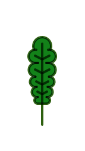
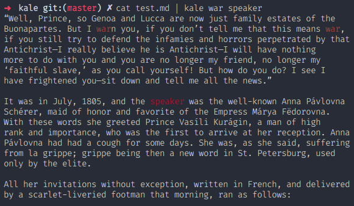

# kale



Kale (colour-tail → cail → kale) behaves similarily to `tail's` live-follow mode, but with extra support for highlighting streamed text.



### Usage

```
kale
```

Kale is built to help find important logs; for example:

```
kale --whole Timeout < /var/log/syslog | less

# or
cat /var/log/syslog | kale --whole Timeout | less
```

highlights timeout logs and passes them to `less` to let you scroll through highlighted text.

### Installation

On Linux distributions that support Snap packages, run:

```
sudo snap install kale
```

### Changelog

#### v0.7.0

- Fixed validation of config files; specifying only literals in a config file caused undefined errors.

#### v0.6.0

- Added support for named patterns drawn from ,json pattern files (see CLI help for more details)
- Removed `--default` flag, since this was always applied when no patterns were provided
- Added experimental variable support to named patterns. The exact syntax may change during the next release.

#### v0.5.0

- Added error-handling for invalid regular expressions

#### v0.4.0

- Added `strip-ansi-stream` to remove ansi escape sequences from input data.

#### v0.3.0

- Reported nodejs/node #8095, and updated to v7.10.0 which fixed a bug in which Kale only worked for a limited number of lines before halting.

#### v0.2.0

- Corrected error in which documentation incorrectly displayed project author.

- Added inverted-colour mode — --invert — which highlights match backgrounds rather than characters. This is useful when matches are rare.

- Added options to highlight whole-line, — --whole-line — rather than individual matches, which is useful for spotting key-lines in a log-file.

- uncaught errors are now presented tidily to the user.

### Icon

The project icon was made by Amy Devereux as part of her project 365cons and is used with permission. If you wish to use this icon yourself, contact Amy.

### License

The MIT License

Copyright (c) 2020 Róisín Grannell

Permission is hereby granted, free of charge, to any person obtaining a copy of this software and associated documentation files (the "Software"), to deal in the Software without restriction, including without limitation the rights to use, copy, modify, merge, publish, distribute, sublicense, and/or sell copies of the Software, and to permit persons to whom the Software is furnished to do so, subject to the following conditions:

The above copyright notice and this permission notice shall be included in all copies or substantial portions of the Software.

THE SOFTWARE IS PROVIDED "AS IS", WITHOUT WARRANTY OF ANY KIND, EXPRESS OR IMPLIED, INCLUDING BUT NOT LIMITED TO THE WARRANTIES OF MERCHANTABILITY, FITNESS FOR A PARTICULAR PURPOSE AND NONINFRINGEMENT. IN NO EVENT SHALL THE AUTHORS OR COPYRIGHT HOLDERS BE LIABLE FOR ANY CLAIM, DAMAGES OR OTHER LIABILITY, WHETHER IN AN ACTION OF CONTRACT, TORT OR OTHERWISE, ARISING FROM, OUT OF OR IN CONNECTION WITH THE SOFTWARE OR THE USE OR OTHER DEALINGS IN THE SOFTWARE.
